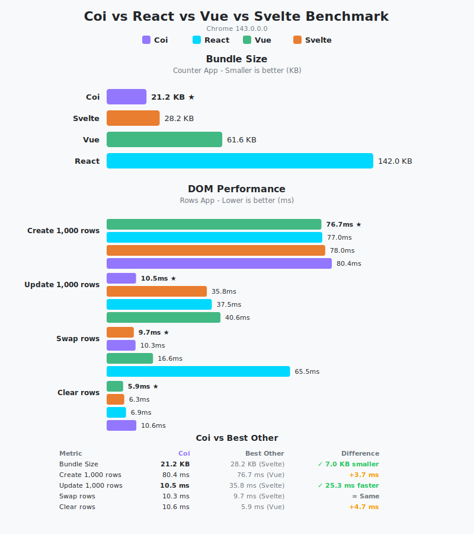

# Coi vs React vs Vue Benchmark

This directory contains a benchmark comparing **Coi**, **React**, and **Vue** for a simple Counter application.

The benchmark builds a counter application in all three frameworks and measures:
- **Bundle Size**: Total size of the production build (HTML + JS + CSS + WASM).

## Prerequisites

- **Python 3**: For the runner script.
- **Node.js & npm**: Required to build the React and Vue benchmarks.
- **Coi**: The project itself (`coi` command must be in PATH or built locally).

## Running the Benchmark

To build all projects and run the benchmark:

```bash
./run_benchmark.sh
```

This script will:
1. Build the Coi project (`coi-counter/`).
2. Build the React project (`react-counter/`).
3. Build the Vue project (`vue-counter/`).
4. Run `runner.py`, which starts a local server and opens the benchmarks in your default browser.
5. Collect results and generate a report.

If you have already built the projects and just want to run the benchmark:

```bash
python3 runner.py --no-build
```

## Results

The runner generates two files:
- `benchmark_results.json`: Raw data including file sizes and runtime metrics.
- `benchmark_results.svg`: A visual comparison chart.



## Structure

- `coi-counter/`: Source code for the Coi implementation.
- `react-counter/`: Source code for the React implementation.
- `vue-counter/`: Source code for the Vue implementation.
- `runner.py`: Python script that orchestrates the benchmark, collects data, and generates reports.
- `run_benchmark.sh`: Bash script to build everything.

